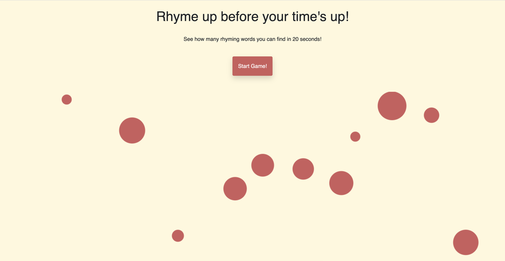
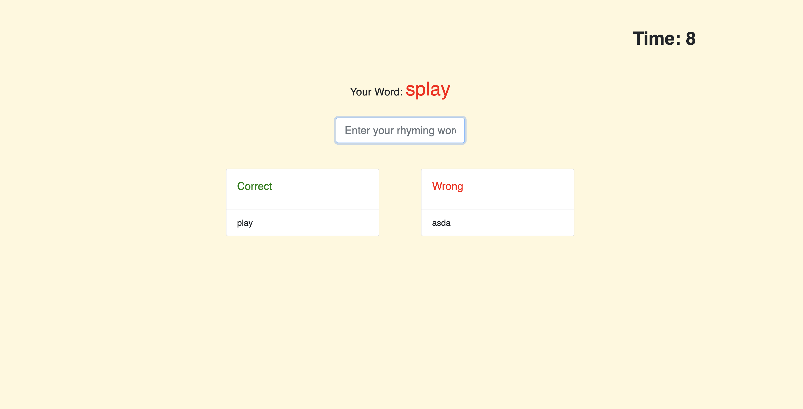
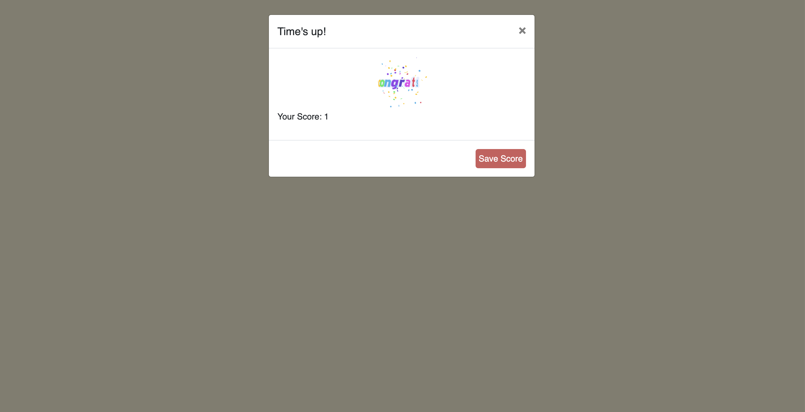
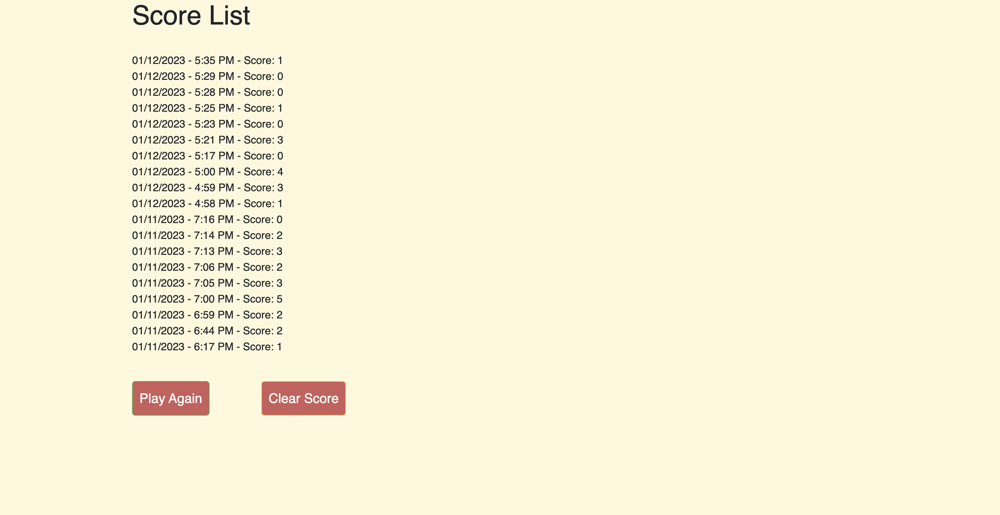

# Rhyme Up Game
# :book: Rhyme up before your time's up!
User story:
* To develop a fun and educational word game that allows a player to practice rhyming words. This is a timed application allowing the user to store their scores for future evaluation.

## How to play
* No installation is required to play this game, click on the link.
* Press the start-game button, player will be presented with a random word and an input box to enter a      rhyming word.
* Player has 20 seconds to enter as many rhyming words as possible into the input box.
* Time starts as soon as the player press the Start Game! button.
* Correct rhyming words will be displayed in the correct box, wrong rhyming words will be displayed in the wrong box.
* Times up! At the end of 20 seconds, the amount of correct words that the player achieved will be displayed and stored.

### Live Link
https://ozgunefe.github.io/Rhyming-Word-Game

## :memo: API's
- WordsAPI
- GiphyAPI
## :memo: Technologies Used
- JQuery
- JavaScript
- CSS
- HTML
- JSON
- MomentJS
- Bootstrap

### Tools used: 
- VS Code
- draw.io
- GitHub

## Screenshots
### Start Screen

### Game Screen

### Score Screen

### Score List Screen
